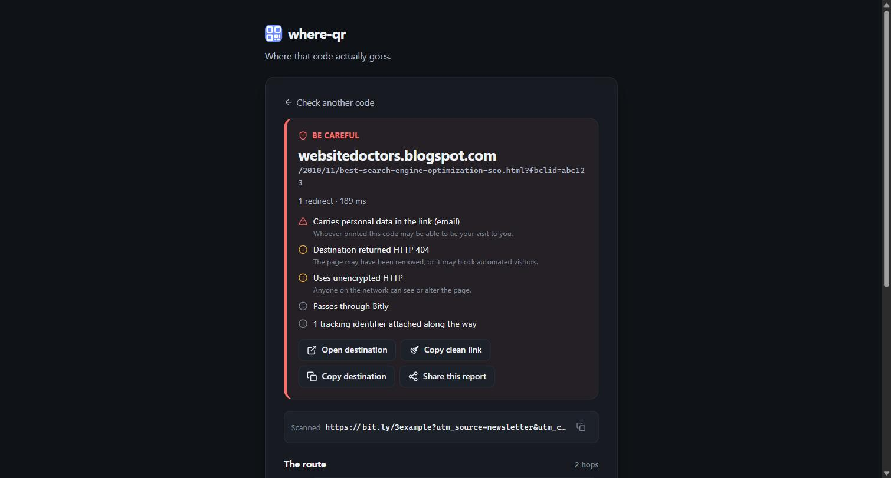

# where-qr

**See where a QR code goes before you do.**

Point your camera at a QR code (or paste a link, or drop in a photo) and where-qr follows the whole trail: every redirect hop, every shortener and tracking service in between, and every query parameter riding along, including the ones that carry your email address or an account id. You get a one-glance verdict and the final destination before anything opens in your browser.

<p align="center">
  
</p>

> Live demo: _add your Vercel URL here_

## Why

Printed QR codes are opaque. The code on a restaurant table or a parking meter almost never points at the restaurant or the city. It points at a QR service, which bounces through a shortener, which lands on a page with a dozen tracking parameters attached. Phones show you none of that; they just open the final page. where-qr shows the route.

## What it does

- **Three ways in.** Live camera (rear camera, torch toggle, native `BarcodeDetector` with a jsQR fallback), a pasted link, or an image via file picker, drag-and-drop, or paste.
- **Follows every kind of redirect.** HTTP `Location` headers, JavaScript `location` assignments, and `<meta http-equiv="refresh">`, up to ten hops, with loop detection and a clear notice when the chain is cut short.
- **Classifies each hop.** Shorteners, QR services, ad networks, analytics, email-marketing link wrappers, social link shims, CDNs. Suffix matching means `l.facebook.com` and `m.facebook.com` are told apart.
- **Reads the query string.** UTM and click ids, session tokens, and personal identifiers are recognised by name, by family (`utm_*`, `*clid`), and by value shape (email addresses, JWTs, UUIDs).
- **Gives a verdict.** Reachability, personal data in the link, HTTPS-to-HTTP downgrades, raw-IP or punycode hosts, embedded credentials, and JavaScript redirects roll up into *Looks clean*, *Worth a look*, or *Be careful*.
- **Clean link.** One tap copies the destination with tracking, attribution, and personal parameters stripped.
- **Shareable reports.** The scanned URL lives in the query string, so a result can be refreshed, bookmarked, or sent to someone.

## How it is built

No framework, no bundler, no build step. The frontend is plain ES modules and a hand-written stylesheet; the only third-party code in the browser is jsQR, loaded with a Subresource Integrity hash for browsers without a native barcode detector.

```
index.html            shell
styles.css            design tokens + components, light and dark
src/
  main.js             controller: routing, events, camera lifecycle
  state.js            single state object + subscribe
  api.js              client for /api/track
  url.js              parsing and display helpers
  ui/
    html.js           escaping tagged template (the XSS boundary)
    render.js         page frame
    views/            input, scanning, results
  scanner/            camera ladder, live detection, image decode
  analysis/
    domains.js        hop classification
    parameters.js     query-string analysis + redaction
    verdict.js        chain → verdict
api/track.js          Vercel function: validation, rate limit, SSRF guard
lib/
  redirects.js        redirect follower (pure, injectable fetch)
  ssrf.js             private-network detection
  ratelimit.js        sliding-window limiter
test/                 node:test suites for everything above
```

### The redirect follower

Redirects are followed server-side in a Vercel function because browsers will not expose cross-origin `Location` headers. The follower:

- refuses to fetch anything that resolves to a loopback, private, link-local, or carrier-grade NAT address, and re-checks on every hop, so a public shortener cannot be used to probe the function's own network;
- caps the response body it reads while looking for JavaScript and meta redirects at 512 KB;
- times out each hop, detects loops, and reports when it stops at the hop limit rather than silently truncating;
- is rate limited per client IP and accepts only `GET`;
- keeps no logs and sets `Cache-Control: no-store`.

The page ships a strict Content Security Policy (no inline script or style), `frame-ancestors 'none'`, and a `no-referrer` policy so the sites you inspect never learn you were checking them.

### Rendering

Every view is a pure function from state to markup. Interpolated values are escaped by default through a small tagged template, and event handling is delegated through `data-action` attributes, so a hostile URL or query value can never reach the DOM as markup or as an inline handler.

## Running it locally

```bash
git clone https://github.com/NuclearTacos/where-qr.git
cd where-qr
npm install          # dev tooling only: eslint
npm run dev          # http://localhost:3000, serves the site and mounts the API
npm test
npm run lint
```

The dev server is a 40-line Node script with no dependencies. Camera access needs a secure context, so on a phone use `vercel dev` with a tunnel, or open the deployed site.

Deploy with `vercel --prod`. There is no configuration to set.

## Limitations

- The private-network check resolves DNS before fetching; a host that changes its answer between the check and the fetch (DNS rebinding) could slip through one hop. Blocking at the socket layer would close this.
- Pages that redirect only after running JavaScript (frameworks, bot challenges) are reported as the final destination.
- Rate limiting is in-memory and therefore per warm function instance. It deters abuse; it is not a quota.
- Live camera scanning on iOS Safari uses the jsQR fallback, which is slower than the native detector.

## License

MIT. See [LICENSE](LICENSE).
